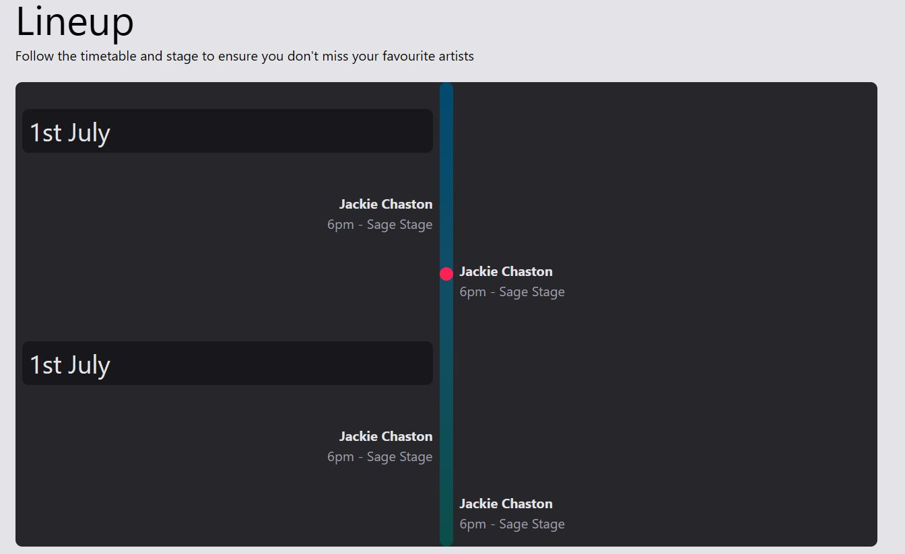

# Tailwind CSS v4 Crash Course: Project Setup and Customization

## This project serves as a practical guide to updating your Tailwind CSS setup to version 4, focusing on key features like custom font integration, CSS variables, custom variants, and animations.

## 1. Introduction

Welcome to the Tailwind CSS v4 Crash Course project! This repository demonstrates how to leverage the new features and updated syntax in Tailwind CSS v4. Whether you're migrating an existing project or starting fresh, this guide will help you get up and running with the latest version.

## 2. Key Changes in Tailwind CSS v4

Tailwind CSS v4 introduces several significant updates, including:

- **New Build Process:** Often involves a more integrated CLI or build tool setup.
- **Enhanced Configuration:** Potential changes in `tailwind.config.js` structure or capabilities.
- **Advanced CSS Features:** Better support for CSS variables, custom variants, and complex selectors directly within the configuration or CSS.
- **Performance Optimizations:** Expect faster build times and a more optimized output CSS.

_(Note: Specific v4 features are highlighted throughout this README.)_

## 3. some Rando Images Setup

### Prerequisites





### Installation

1.  Clone this repository:

```bash
git clone https://github.com/amiralim1377/tailwind-v4-project.git
cd tailwind-v4

```
